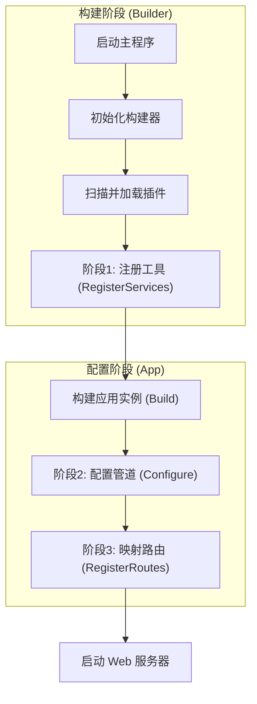

# 架构一览

本文将从宏观角度介绍 SharwAPI 的整体设计。

SharwAPI 采用了 **宿主 + 插件** 架构。主程序本身是一个轻量级的容器，它不包含具体的业务功能，而是负责为 **插件** 提供运行环境和基础设施。

## 核心设计理念

1.  **职责分离**：**主程序** 只负责生命周期管理（启动、加载、卸载）；**插件** 负责具体的业务逻辑（API 接口、数据处理）。
2.  **高度模块化**：所有的功能（包括路由、数据库连接、中间件）均通过插件实现，实现了“按需组装”。
3.  **统一托管**：通过集成的 **托管模式（依赖注入）**，实现模块间的资源共享和松耦合。

## 系统分层

SharwAPI 的架构由以下三个核心部分组成：

### 1. 宿主层：主程序 (Sharw.Core)
* **职责**:
    * **环境初始化**：建立全局的日志和托管容器。
    * **配置加载器**：自动扫描 `config/` 目录，为每个插件加载其专属的配置文件。
    * **插件管理**：扫描 `Plugins` 目录，加载插件文件 (`.dll`)，并管理其生命周期。
    * **流程编排**：按照既定顺序，依次调用插件的服务注册、中间件配置和路由映射方法。

### 2. 标准层：插件协议库 (Sharw.Contracts)
* **职责**:
    * **定义标准**：定义核心接口 `IApiPlugin`，规定一个合法的插件应该长什么样。
    * **提供基类**：提供 `SharwPluginBase` 等辅助类，简化插件开发。
    * **类型共享**：包含所有插件公用的数据结构和工具类，确保通讯顺畅。

### 3. 业务层：插件 (Plugins)
* **职责**:
    * **实现业务**：编写具体的 API 接口逻辑。
    * **注册组件**：向主程序申请所需的数据库、缓存等工具。
    * **处理请求**：拦截并处理流经管道的 HTTP 请求。

## 启动流程详解

当 SharwAPI 启动时，会严格按照以下步骤执行：

1.  **环境初始化**: 主程序启动，创建全局构建器，配置日志系统。
2.  **插件加载**: 扫描插件目录，读取并加载所有实现了 `IApiPlugin` 协议的程序集。
3.  **注册服务 (RegisterServices)**: 遍历所有插件，将其定义的依赖服务注册到全局容器中。
4.  **构建应用 (Build)**: 锁定容器，生成可运行的应用实例。
5.  **配置管道 (Configure)**: 遍历所有插件，将其定义的中间件插入到 HTTP 请求处理管道中。
6.  **映射路由 (RegisterRoutes)**: 遍历所有插件，挂载其定义的 API 接口地址。
7.  **开始运行**: 启动 Web 服务器，开始监听并处理外部请求。

## 流程图表

