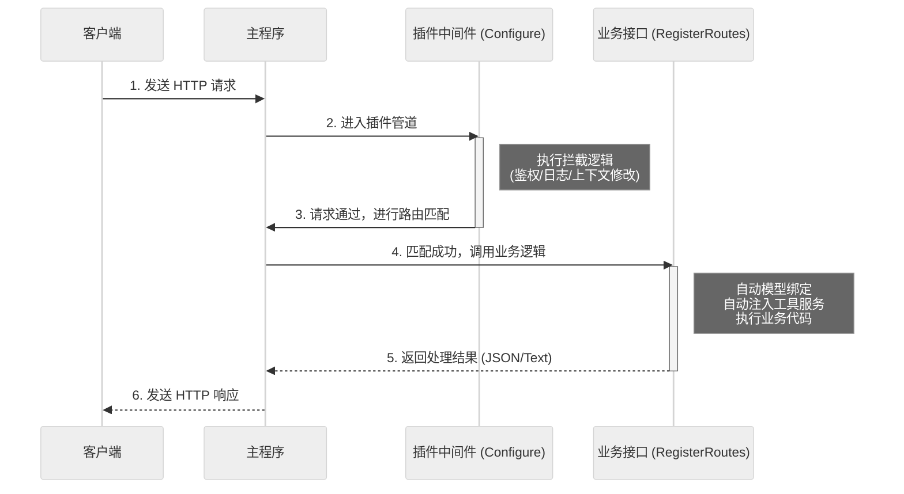

# 请求处理流程

本文将解析一个 HTTP 请求在 SharwAPI 中的完整流转过程。理解这一流程有助于开发者清楚地知道自己的代码（中间件或路由）是在哪个环节被执行的。

## 处理管道

SharwAPI 基于 ASP.NET Core 的管道模型。当一个外部请求到达主程序时，它会像流水线产品一样，依次经过一系列的处理节点。

### 1. 基础设施层 (主程序接管)
请求最先由主程序配置的全局中间件处理。
* **职责**：
    * **全局异常捕获**：如果后续的插件代码抛出未处理的异常，主程序会在此处捕获并返回标准的 500 错误响应，防止程序崩溃。
    * **基础网络处理**：处理 HTTPS 重定向、静态文件服务等底层逻辑。

### 2. 插件拦截层 (Configure)
请求接着进入由各个插件在 `Configure` 方法中定义的中间件列表。
* **执行顺序**：取决于插件的加载顺序（通常按字母顺序或依赖关系）。
* **职责**：
    * **拦截与修改**：插件可以读取请求头、修改上下文信息（如 `HttpContext.Items`）。
    * **鉴权**：检查请求是否携带了有效的 Token 或 API Key。
    * **传递控制权**：插件必须调用 `next()` 将请求传递给下一个环节。如果不调用，请求将在此处 **短路**（直接返回响应），后续的插件和路由都不会执行。

### 3. 路由匹配层 (Routing)
当请求穿过所有中间件后，主程序会根据 URL 地址查找目标。
* **机制**：主程序会扫描内存中的路由表（由各个插件在 `RegisterRoutes` 中注册）。
* **结果**：如果找到匹配的路径（例如 `/api/demo/hello`），则准备执行对应的处理函数；如果找不到，则返回 404 Not Found。

### 4. 业务执行层 (RegisterRoutes)
这是请求的终点，也是插件核心业务逻辑执行的地方。
* **模型绑定**：主程序自动解析 URL 参数或 JSON 请求体，将其转换为 C# 对象。
* **依赖注入**：主程序从容器中取出插件所需的工具（如数据库服务），注入到处理函数的参数中。
* **执行逻辑**：运行开发者编写的代码，并生成最终结果（如 JSON 数据）。

### 5. 响应回流
执行结果生成后，响应数据会沿着管道原路返回。此时，中间件可以再次介入（例如记录“请求耗时”或修改响应头），最终发送给客户端。

## 流程图解

