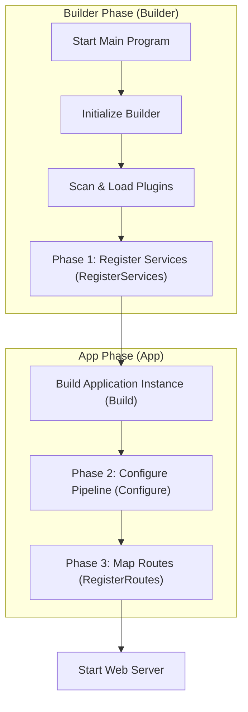

# Architecture Overview

This article provides a macroscopic view of SharwAPI's overall design.

SharwAPI adopts a **Host + Plugin** architecture. The main program itself is a lightweight container that does not contain specific business features but is solely responsible for providing the runtime environment and infrastructure for **Plugins**.

## Core Philosophy

1.  **Separation of Duties**: The **Main Program** is only responsible for lifecycle management (startup, loading, unloading); **Plugins** are responsible for specific business logic (API endpoints, data processing).
2.  **Highly Modular**: All functionalities (including routing, database connections, middleware) are implemented via plugins, achieving "on-demand assembly".
3.  **Unified Hosting**: Through the integrated **Hosting Model (Dependency Injection)**, resource sharing and loose coupling between modules are achieved.

## System Layers

SharwAPI's architecture consists of three core parts:

### 1. Host Layer: Main Program (Sharw.Core)
* **Responsibilities**:
    * **Environment Initialization**: Establish global logging and hosting containers.
    * **Plugin Management**: Scan the `plugins` directory, load plugin files (`.dll`), and manage their lifecycles.
    * **Configuration Loader**: Scan the `config/` directory to load exclusive configuration files for each plugin.
    * **Flow Orchestration**: Call plugin methods for service registration, middleware configuration, and route mapping sequentially.

### 2. Standard Layer: Plugin Protocol Library (Sharw.Contracts)
* **Responsibilities**:
    * **Define Standards**: Define the core interface `IApiPlugin`, specifying what a valid plugin should look like.
    * **Type Sharing**: Contain data structures and utility classes common to all plugins, ensuring smooth communication.

### 3. Business Layer: Plugins (Plugins)
* **Responsibilities**:
    * **Implement Business Logic**: Write specific API endpoint logic.
    * **Register Components**: Request required tools like databases, caches from the main program.
    * **Handle Requests**: Intercept and process HTTP requests flowing through the pipeline.

## Startup Flow Explained

When SharwAPI starts, it strictly follows these steps:

1.  **Environment Initialization**: The main program starts, creates a global builder, and configures the logging system.
2.  **Plugin Loading**: Scans plugin directories, reading and loading all assemblies implementing the `IApiPlugin` protocol.
3.  **Register Services (RegisterServices)**: Iterates through all plugins, registering dependency services defined by plugins into the global container.
4.  **Build Application (Build)**: Locks the container and generates a runnable application instance.
5.  **Configure Pipeline (Configure)**: Iterates through all plugins, inserting their defined middleware into the HTTP request processing pipeline.
6.  **Map Routes (RegisterRoutes)**: Iterates through all plugins, mounting their defined API endpoint addresses.
7.  **Start Running**: Starts the Web server, beginning to listen for and handle external requests.

## Flowchart

