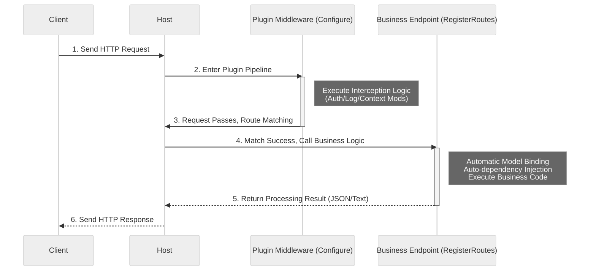

# Request Processing Flow

This article explains the complete flow of an HTTP request within SharwAPI. Understanding this flow helps developers clearly know where their code (middleware or routes) is executed.

## Processing Pipeline

SharwAPI is based on the ASP.NET Core pipeline model. When an external request reaches the main program, it passes through a series of processing nodes sequentially, like products on an assembly line.

### 1. Infrastructure Layer (Host Takeover)
The request is first processed by the global middleware configured by the main program.
* **Responsibilities**:
    * **Global Exception Handling**: If subsequent plugin code throws an unhandled exception, the main program catches it here and returns a standard 500 error response to prevent the application from crashing.
    * **Basic Network Processing**: Handles low-level logic such as HTTPS redirection and static file serving.

### 2. Plugin Interception Layer (Configure)
The request then enters the list of middleware defined by each plugin in their `Configure` method.
* **Execution Order**: Depends on the plugin loading order (usually alphabetical or by dependency).
* **Responsibilities**:
    * **Interception & Modification**: Plugins can read request headers and modify context information (like `HttpContext.Items`).
    * **Authentication**: Check if the request carries a valid Token or API Key.
    * **Passing Control**: A plugin must call `next()` to pass the request to the next stage. If `next()` is not called, the request **short-circuits** here (returns a response immediately), and subsequent plugins or routes will not be executed.

### 3. Route Matching Layer (Routing)
After the request passes through all middleware, the main program looks up the target based on the URL address.
* **Mechanism**: The main program scans the in-memory route table (registered by each plugin in `RegisterRoutes`).
* **Result**: If a matching path is found (e.g., `/api/demo/hello`), it prepares to execute the corresponding handler function; if not found, it returns 404 Not Found.

### 4. Business Execution Layer (RegisterRoutes)
This is the endpoint of the request and where the core business logic of plugins is executed.
* **Model Binding**: The main program automatically parses URL parameters or JSON request bodies and converts them into C# objects.
* **Dependency Injection**: The main program retrieves dependencies required by the plugin (like database services) from the container and injects them into the handler function's parameters.
* **Execution Logic**: Runs the developer-written code and generates the final result (e.g., JSON data).

### 5. Response Return
After the execution result is generated, the response data flows back along the pipeline. At this point, middleware can intervene again (for example, to record "request duration" or modify response headers) before finally sending it to the client.

## Flow Diagram

